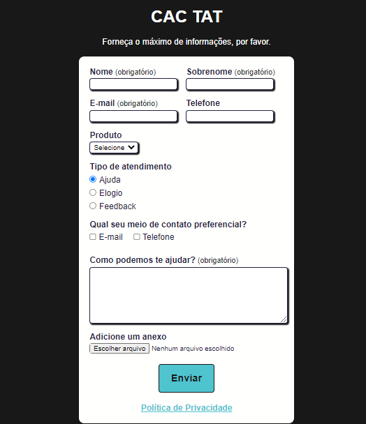

# **Testes automatizados com Cypress**

Exemplo de projeto para o curso básico da escola online Talking About Testing.

## Pré-requisitos

É necessário ter Node.js e npm instalados para executar este projeto.

> Usei as versões `v16.13.2` e `9.3.0` de Node.js e npm, respectivamente. Sugiro que você use as versões iguais ou posteriores.

## Instalação

Execute `npm install` (ou `npm i` para a versão curta) para instalar as dependências de desenvolvimento.

## Testes

Você pode executar a simulação de um desktop ou viewport móvel.

### Desktop

Execute `npm test` (ou `npm t` para a versão curta) para executar o teste no modo headless em uma janela de visualização da área de trabalho.

Ou execute `npm run cy:open` para abrir o Cypress no modo interativo em uma janela de visualização da área de trabalho.

### Mobile

Execute `npm run test:mobile` (ou `npm t` para a versão curta) para executar o teste no modo headless em uma viewport móvel.

Ou execute `npm run cy:open:mobile` para abrir o Cypress no modo interativo em uma viewport móvel.

---

## Screenshots e uso

A aplicação se chama Central de Atendimento ao Cliente TAT - [**CAC TAT**](https://cac-tat.s3.eu-central-1.amazonaws.com/index.html).

## Funcionalidades da aplicação 💻

A aplicação **CAC TAT** é um formulário para simular o envio de mensagens à uma central de atendimento ao cliente.

### Campos obrigatórios ⚠️

Os seguintes campos são obrigatórios, por padrão:

- Nome (campo do tipo texto)
- Sobrenome (campo do tipo texto)
- Email (campo do tipo email, **com validacão**)
- Como podemos te ajudar? (campo de área de texto)

### Outros campos

Além dos campos obrigatórios, o "cliente" pode informar:

- Seu telefone (campo do tipo número)
- O produto ao qual deseja atendimento (campo de seleção suspensa com as opções Blog, Cursos, Mentoria e YouTube)
- O tipo de atendimento (campos do tipo radio com os valores Ajuda, Elogio e Feedback)
- Meio de contato preferêncial (campos de checkbox com os valores Email e Telefone)
- Um anexo (o "cliente" pode adicionar um arquivo como anexo ao atendimento)

### Regras dos meios de contato preferenciais

- Quando o checkbox Telefone é marcado, o input do número do telefone passa a ser obrigatório
- Ao desmarcar o checkbox Telefone, o input do número do telefone deixa de ser obrigatório

### Política de privacidade

Ao clicar no link [Política de privacidade](https://cac-tat.s3.eu-central-1.amazonaws.com/privacy.html), na parte inferior da página, tal página é aberta em uma nova aba do navegador.

### Mensagens ✉️

⚠️ Caso haja algum problema relacionado aos campos obrigatórios, a seguinte mensagem é exibida (em um fundo amarelo): `Valide os campos obrigatórios!`.

✅ Ao submeter o formulário com sucesso, a seguinte mensagem é exibida (em um fundo verde): `Mensagem enviada com sucesso.`

> Além disso, quando o formulário é enviado com sucesso, todos os campos voltam ao seu estado padrão.

---

## Apoie este projeto

Se você quer apoiar este projeto, deixe uma ⭐.
